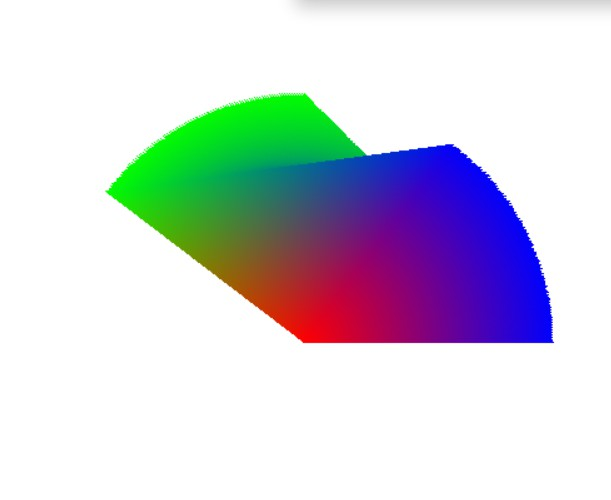

### 二维部分
- [x] canvas像素级操作(左x 下y) 模仿openglAPI 分离clear draw setPixel setLine set三角形等操作 draw太耗费性能
- [x] 画线
- [x] 画三角框
- [x] 绘制时指定颜色
- [x] 三角形填充 ~~扫描线~~ 重心坐标
- [x] 颜色插值 插值
> 二维需要做到的是 根据屏幕坐标画点 画线 画三角
> 屏幕坐标要注意 (左x 下y) => 写算法时还是要注意到数学坐标系与屏幕坐标系的差异
> 插值很重要  通过插值, 就能很好的得到两点之间的任意点, 就能通过"扫描" 把线画出来, 把线上的点定位到 
> 除了空间位置能插值, 颜色也能插值,时间之间也能插值 
### 三维部分
- [x] 实现MVP变换
  - [x] 实现model矩阵让三角形能平移 旋转 缩放
  - [ ] 透视投影

bug 创建渲染循环是, 没有清空画布

### 着色
- [x] 顶点着色
- [ ] 纹理着色

### 深度
- [ ] 使用深度