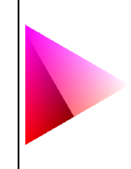
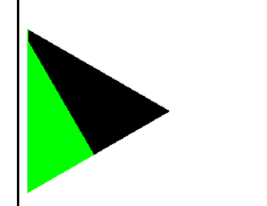

### 二维部分
- [x] canvas像素级操作(左x 下y) 模仿openglAPI 分离clear draw setPixel setLine set三角形等操作 draw太耗费性能
- [x] 画线
- [x] 画三角框
- [x] 绘制时指定颜色
- [x] 三角形填充 ~~扫描线~~ 重心坐标
  -[ ] 三角形接缝太大
- [x] 颜色插值 插值
> 二维需要做到的是 根据屏幕坐标画点 画线 画三角
> 屏幕坐标要注意 (左x 下y) => 写算法时还是要注意到数学坐标系与屏幕坐标系的差异
> 插值很重要  通过插值, 就能很好的得到两点之间的任意点, 就能通过"扫描" 把线画出来, 把线上的点定位到 
> 除了空间位置能插值, 颜色也能插值,时间之间也能插值 
### 三维部分
- [x] 实现MVP变换
  - [x] 实现model矩阵让三角形能平移 旋转 缩放
  - [ ] 实现model矩阵能让 物体进行 平移 旋转 缩放
  - [ ] 透视投影 
  - [ ] 相机控制
- [x] 渲染多个三角形
- [x] 深度测试
  - [ ]  ~~1.深度没有归一化,没有视锥剔除~~ 
  - [ ] 2.深度缓冲太大, 其实一位就够了3.深度测试相关代码分布再不同地方 代码维护不方便
- [ ] 渲染彩色立方体, 支持顶点数组 索引三角形 

#### 剔除 (视锥剔除(整个图元在外部)  遮挡剔除 背面剔除)

bug 创建渲染循环是, 没有清空画布[OK]

> ???一个顶点流程走下来,还是 顶点处理完处理片元  (流水线怎么安排)
bug 深度测试还有点问题[OK]

### 纹理
- [ ] 纹理映射

### 顶点处理
- [ ] 顶点法线 切线等
### 着色
- [x] 顶点着色
  - [ ] 暂时没想好怎么处理顶点色和纹理映射的函数写法
- [ ] 纹理着色
- [ ] 实现各种光照模型

### 编程相关
- [ ]订阅发布模式

### 简易相机控制
